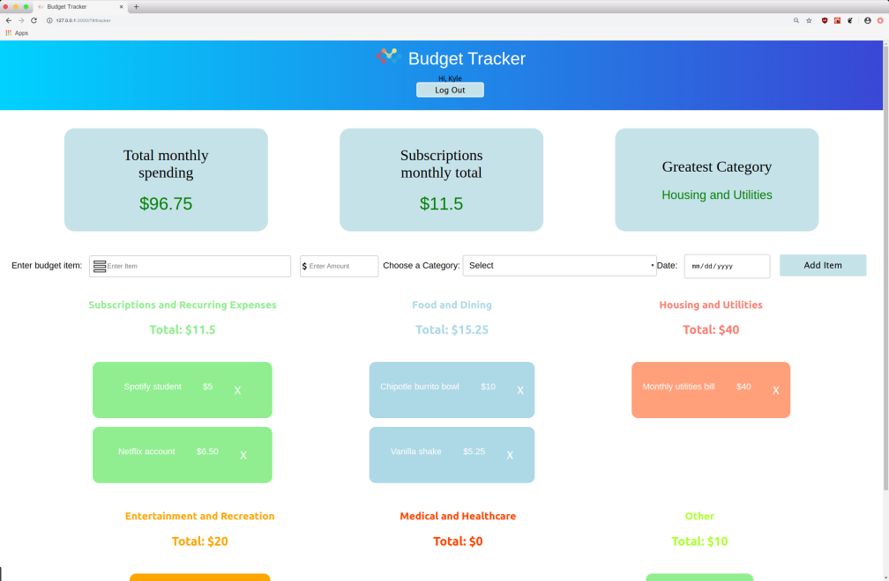
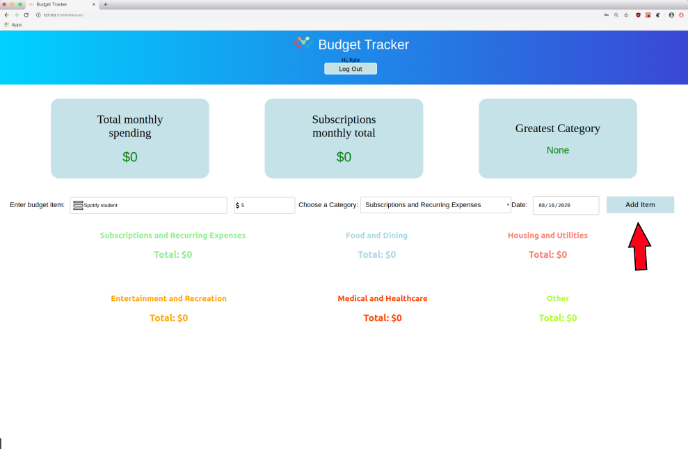
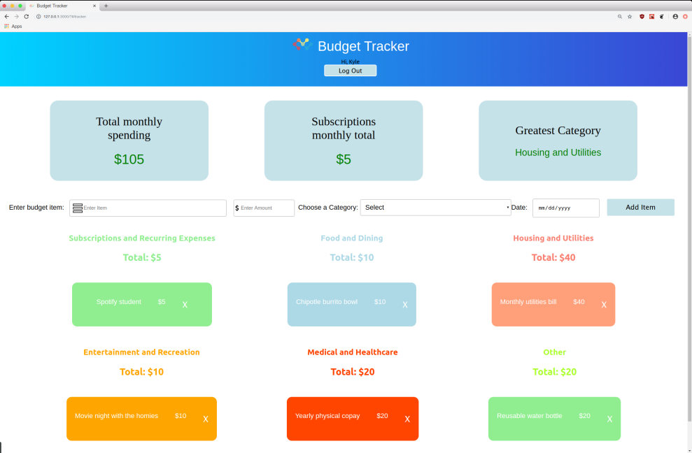
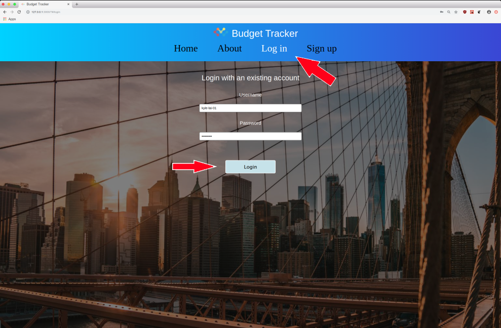

# Budget-Tracker
[](https://opensource.org/licenses/MIT)
## Table of Contents

* [About the Budget Tracker](#about-the-budget-tracker)
  * [Built With](#built-with)
* [Getting Started](#getting-started)
  * [Prerequisites](#prerequisites)
  * [Installation](#installation)
* [Usage](#usage)
* [Contributing](#contributing)
* [License](#license)
* [Contact](#contact)
* [Acknowledgements](#acknowledgements)


## About The Budget Tracker
<br />
 

Budget Tracker is a simplistic way to enter in your monthly expenses to help you track your budget. <br />
Entering your budget items takes a few clicks, and your entries can be easily saved. 
<br />

Some core features: 
* Input budget items by categories.
* Summary of expenses.
* Log in and save items.


### Built With
* ReactJS
* Flask

## Getting Started 

To set up and run the Budget Tracker on your local machine, follow the below steps. 

### Prerequisites 
* npm
* python3

### Installation 
1. Clone the repo
```sh
git clone https://github.com/henryli6/Budget-Tracker.git
```

2. Install NPM packages 
```sh
cd Budget-Tracker
cd budget-tracker-frontend
npm install
cd .. 
```

3. Install Python packages
```sh
cd api
pip3 install -r requirements.txt
cd .. 
```

4. Start the local server 
```sh
flask run
cd budget-tracker-frontend
npm start
```

## Usage
To access the website: <br />
Visit http://127.0.0.1:3000/ (or equivalent link by your terminal) <br />
NOTE: Do not open the app in http://localhost:3000/ 


### Steps to use the app
1. Sign up <br />
<br />

<br />
2. Enter info to add automatically saved items <br />
<br />

<br />
3. Add more items, press X to remove <br />
<br />

<br />
4. Log in to access your items <br />
<br />

<br />

## Contributing

Contributions are what make the open source community such an amazing place to be **learn**, **inspire**, and **create**. <br/> 
Any contributions you make are **greatly appreciated**.

1. Fork the Project
2. Create your Feature Branch (`git checkout -b feature/FeatureName`)
3. Commit your Changes (`git commit -m 'Add some FeatureName'`)
4. Push to the Branch (`git push origin feature/FeatureName`)
5. Open a Pull Request

## License
Distributed under the MIT License. See `LICENSE` for more information. <br/>
[](https://opensource.org/licenses/MIT)

## Contact

Henry Li - [@henryli6](https://github.com/henryli6) - hl738@cornell.edu <br />
Kyle Lai - [@kyle-lai-01](https://github.com/kyle-lai-01) - kl655@cornell.edu


Project Link: [https://github.com/henryli6/Budget-Tracker](https://github.com/henryli6/Budget-Tracker)

## Acknowledgements
* [create-react-app](https://reactjs.org/docs/create-a-new-react-app.html)
* [react-router](https://github.com/ReactTraining/react-router)
* [FlaskSQLAlchemy](https://flask-sqlalchemy.palletsprojects.com/en/2.x/)
* [Flask-Bcrypt](https://flask-bcrypt.readthedocs.io/en/latest/)
* [JWT](https://jwt.io/)
